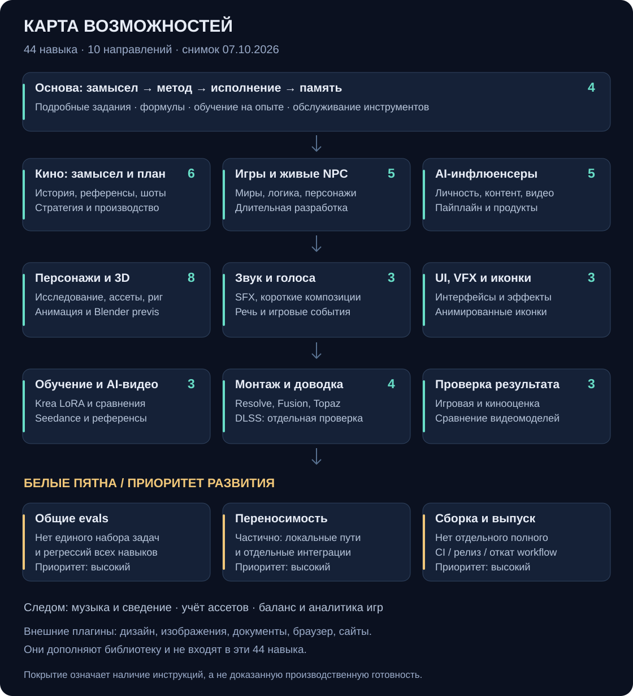

<p align="center"></p>

<h1 align="center">Creative Production Skills</h1>

<p align="center"><strong>Рабочая библиотека навыков для творческого AI-производства</strong><br>Игры · кино · персонажи · звук · процедурная генерация · AI-видео</p>

<p align="center"><a href="docs/SKILL_MAP_RU.md">Карта и белые пятна</a> · <a href="docs/CATALOG_RU.md">Все 44 навыка</a> · <a href="docs/SKILL_SOURCES_RU.md">Где искать сильные навыки</a> · <a href="docs/USAGE_RU.md">Как использовать</a></p>

---

## От идеи до проверяемого результата

Коллекция связывает замысел, референсы, математические модели, инструменты и оценку
готового результата. Каждый навык находится в своей папке: инструкции `SKILL.md`,
а при необходимости — справочники, шаблоны и исполняемые помощники.

**44 навыка в 10 направлениях.** Это снимок пользовательской библиотеки на
7 октября 2026 года. Системные навыки, плагины и резервные копии сюда не входят.

<p align="center"><a href="docs/SKILL_MAP_RU.md"></a></p>

## С чего начать

| Нужно | Точка входа |
|---|---|
| Превратить идею в подробное производственное задание | [production-brief-architect](skills/production-brief-architect/SKILL.md) |
| Найти, вывести и проверить формулы под задачу | [formula-driven-production](skills/formula-driven-production/SKILL.md) |
| Довести продолжительную разработку игры до этапа приёмки | [game-long-run-production](skills/game-long-run-production/SKILL.md) |
| Спланировать и собрать фильм | [cinema-production](skills/cinema-production/SKILL.md) |
| Создать управляемые звуковые эффекты | [procedural-audio](skills/procedural-audio/SKILL.md) |
| Спроектировать характер и поведение NPC | [living-npc-brain](skills/living-npc-brain/SKILL.md) |

```text
Используй formula-driven-production.
Задача: [что должно происходить].
Инструмент и ограничения: [что известно].
Подбери модель, проверь её, сделай редактируемую реализацию
и сохрани источники, результаты тестов и ограничения.
```

## Ориентиры качества

Навык → реализация → численная проверка → проверка в целевом инструменте →
художественная оценка. Эти состояния не подменяют друг друга. Некоторые навыки
привязаны к локальным приложениям, путям и базе знаний. Это **рабочая коллекция с
явными ограничениями**, а не обещание универсальной установки без настройки.

- [Карта покрытия и приоритеты развития](docs/SKILL_MAP_RU.md)
- [Каталог с описанием каждого навыка](docs/CATALOG_RU.md)
- [Отбор внешних навыков и проверенные источники](docs/SKILL_SOURCES_RU.md)
- [Использование, зависимости и обновления](docs/USAGE_RU.md)
- [Происхождение и условия компонентов](THIRD_PARTY_NOTICES.md)

## Состав и проверка

`skills/` — навыки · `docs/` — карта и руководства · `catalog.json` — структура
каталога · `collection-manifest.json` — файлы, SHA-256 и изменения публичной редакции.

```bash
python scripts/validate_collection.py
```

В публичной редакции исключены кэш и оригинальный сторонний hook kit без
подтверждённого разрешения на распространение; сохранены все 44 точки входа.
Рабочие установленные навыки не изменены. Лицензии отдельных компонентов сохранены;
единой новой лицензии на весь репозиторий не назначено.
