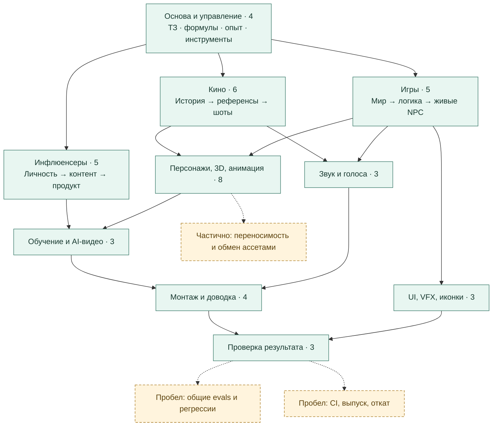

# Карта навыков и белые пятна

**7 октября 2026 · 44 навыка · 10 направлений.** Карта показывает покрытие
инструкциями. Она не присваивает навыкам выдуманные баллы и не подтверждает, что
каждый маршрут уже прошёл проверку от начала до конца.

## Как связаны направления

Сплошная стрелка — возможная передача результата. Пунктир — область развития.
Это рекомендуемый маршрут, а не доказательство готовой автоматической интеграции.

Полный состав каждой группы со ссылками на SKILL.md: [каталог](CATALOG_RU.md).
Данные для собственной визуализации: [catalog.json](../catalog.json).

## Что уже есть вне этих 44

В текущей рабочей среде дополнительно доступны системные навыки и плагины для
изображений, дизайна/Figma, документов, браузера, таблиц, презентаций и сайтов.
Они не копируются в репозиторий: их отсутствие в `skills/` не означает отсутствия
возможности. MCP-инструмент, описание навыка и успешное выполнение — разные вещи.

## Какие пробелы закрывать первыми

Приоритеты ниже — вывод по структуре и содержимому библиотеки, а не результат
производственного бенчмарка. «Нет отдельного навыка» не означает «агент не умеет».

| Приоритет | Область | Что уже есть | Чего конкретно не хватает | Первый проверяемый результат |
|---|---|---|---|---|
| P0 | Оценка навыков и регрессии | cinema-model-evaluation, cinema-quality-review, gameplay-visual-review; отдельные численные тесты | Единого набора задач для проверки выбора навыка, конфликтов, стоимости и повторных поломок всех 44 | 8–12 реальных заданий; baseline без нового навыка; одинаковая модель; артефакты и причины ошибок |
| P0 | Переносимость и обмен между инструментами | cinema-production, film-toolchain-maintenance, навыки Blender/Godot | Общего переносимого контракта путей, координат, единиц, кадров, цвета, имён и версий; проверенного обмена для каждого маршрута | Один ассет Blender → Godot и один шот Blender → видео → Resolve с проверкой масштаба/времени |
| P0 | Репозиторий → сборка → выпуск | game-long-run-production и проверка отдельных результатов | Отдельного полного процесса CI, воспроизводимой сборки, пакета, changelog и отката | Чистое клонирование → сборка тестового проекта → smoke test → воспроизводимый архив |
| P1 | Происхождение и версии ассетов | Provenance в отдельных навыках, evidence/receipts | Единого реестра источников, лицензий, изменений, дубликатов и зависимостей | Manifest маленькой сцены; 100% её файлов с источником и связью с текущей версией |
| P1 | Музыка и финальный звук | procedural-audio, character-voice-production, game-audio-workflow, film-postproduction | Специализированного полного цикла композиции, аранжировки, stems, синхронизации, сведения и мастеринга | Одна минутная сцена: редактируемые stems, синхронизация, прослушивание, проверка пиков и громкости |
| P1 | Баланс, UX и аналитика игры | godot-gameplay-production, game-ui-workflow, godot-look-performance | Отдельных циклов балансировки, проверки обучения игрока, доступности, локализации и анализа игровых событий | Пятиминутный сценарий игры: проверка прохождения, клавиатуры, языка и 3 заранее выбранных метрик |
| P1 | Точная графика и титры для видео | film-postproduction/Fusion и общая математика | Отдельного шаблонного процесса для типографики, субтитров, инфографики и серийных роликов из данных | Один ролик с изменяемыми текстами/данными, точным таймингом и проверкой переполнения |
| P2 | Производство сложного движения и симуляций | Blender-анимация, VFX, formula-driven-production | Специализированных проверенных процедур facial/lip-sync, cloth/hair/fluid и устойчивого экспорта | Выбрать один конкретный эффект; сравнить простой baseline с кандидатом на целевом движке |

Управление очередью GPU, фиксация моделей и прекращение jobs частично описаны
существующими навыками. Универсальный проверенный диспетчер ресурсов из этих текстов
не следует. Создавать его имеет смысл при повторяющихся конфликтующих заданиях.

## Практический порядок улучшений

1. Зафиксировать маленький набор оценочных задач и измерять долю принятых результатов,
   затраченное время, стоимость, число исправлений и нарушения ограничений.
2. Довести один игровой и один кинематографический маршрут между инструментами.
3. Автоматизировать сборку и повторные проверки именно этих маршрутов.
4. Добавлять внешний навык только для наблюдаемого пробела; повторно сравнивать
   результат с текущей библиотекой на тех же заданиях.

Переход к 60 или 100 навыкам сам по себе не является улучшением. Нужна более высокая
доля результатов, которые действительно работают и принимаются пользователем.

[Кандидаты и источники](SKILL_SOURCES_RU.md) · [Как применять библиотеку](USAGE_RU.md)
